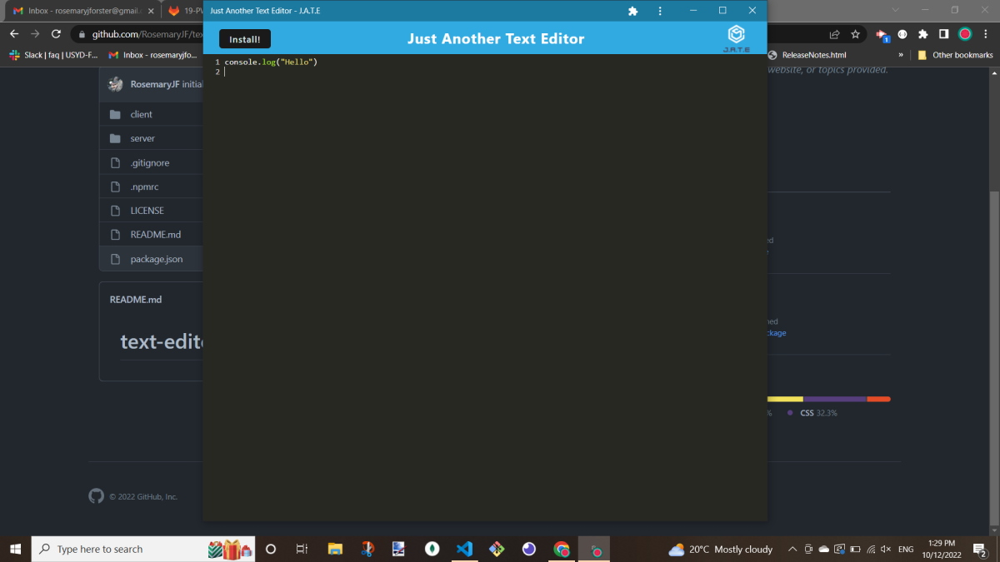
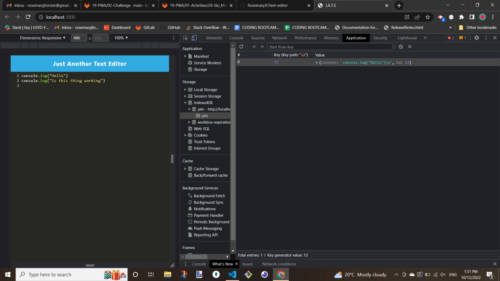
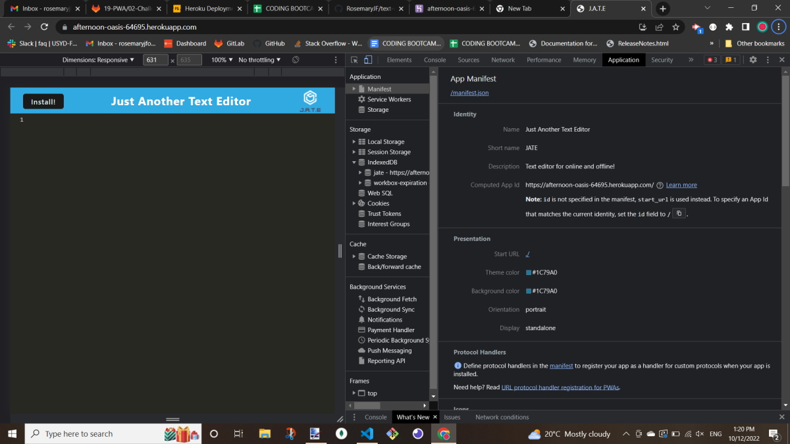
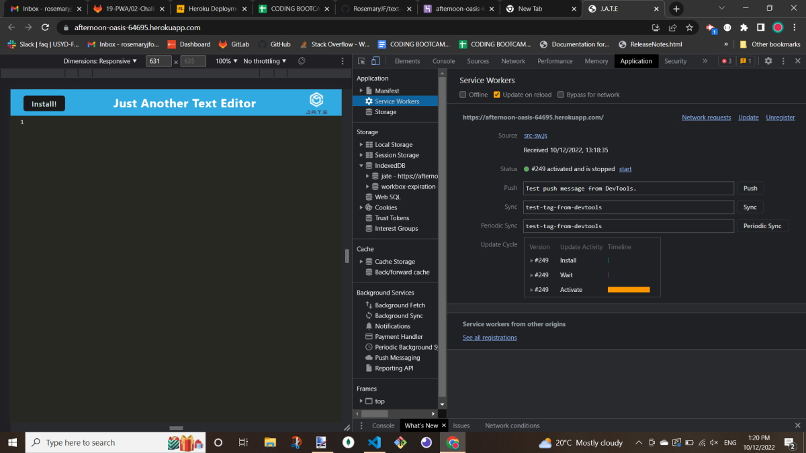

# text-editor

# PWA: Text Editor

## Description

The Just Another Text Editor (J.A.T.E.) application is a front end application that can be used online or offline. It is downloadble from the server to the users local machine. JATE allow a user to create notes or code snippets with or without an internet connection so that they can reliably retrieve them for later use. 

My inspiration was myself! My internet at home is deplorable so being able to have this application function offline was imperative for being able to edit text and save it for myself for later.

I used webpack and service workers on a deployed application for the first time, as well as using 'idb' for getting and putting information to a database. I enjoyed the difference of this route creation as well as ensuring my service worked files met the requirements for the application. JATE was also my first time using a client and server folder structure and I quite enjoyed the seperation of different compenants with it creating a cleaner code that was easier to move around.  

---

## Table of Contents

- [Installation](#installation)
- [Usage](#usage)
- [Features](#features)
- [Future Developments](#future-developments)
- [License](#license)
- [Credits](#credits)

---

## Installation

The user will need to clone the application from my GitHub account: https://github.com/RosemaryJF/text-editor, to their local repository, and have Node.js, npm  and Heroku installed on their local machines, if it isn't already.

Once cloned to the local repository the user will need to run `npm install` through their terminal so that the necessary packages are installed on the application, in both the base, client and server folders. 

From there the user will then need to run `npm run build`, this will build out the server and client folders concurrently. The client folder will run webpack to generate a `dist` folder, with a `manifest.json` and `src-sw.js` files.

Once this is complete the user will be able to test launch the application from their intergrated terminal with the following command: `npm run start` or `npm run start:dev`. They can test the application through localhost on their browser (port `3000`), or alternatively they can run it from a live server. 

Lastly, you can visit the Heroku deployed application via the link below:

- [J.A.T.E. - Heroku deployed link](https://afternoon-oasis-64695.herokuapp.com/)

---

## Usage

As soon as the application is loaded the user can start to pop in text.

Once the user hits enter the text will save to the indexeddb storage. If the user wants to then use the application offline they can download JATE from the URL bar in their server. This will open the application outside of their browser and it continues to function as expected. Please see image below for reference:

If the user wants they can then go back to using JATE in their browser. The text is persisted in indexeddb storage. Please see the image below for reference:

Please see image below for the manifest functionality:

Please see image below for the service worker functionality:

---

## Features

The service worker caching only the required basics to allow for quicker loading.

---

## Future Developments

The header and favicon actually working. They worked a couple of times for me then stoped for some reason. Unable to debug at this stage.

---

## License

This application is licensed under an [MIT license](https://github.com/RosemaryJF/team-profile-generator/blob/main/dist/LICENSE).

---

## Credits

- https://web.dev/offline-fallback-page/

- https://developer.chrome.com/docs/workbox/managing-fallback-responses/#offline-page-only

- https://sydney.bootcampcontent.com/university-of-sydney/USYD-VIRT-FSF-PT-07-2022-U-LOLC/-/tree/main/19-PWA/01-Activities/28-Stu_Mini-Project/Main